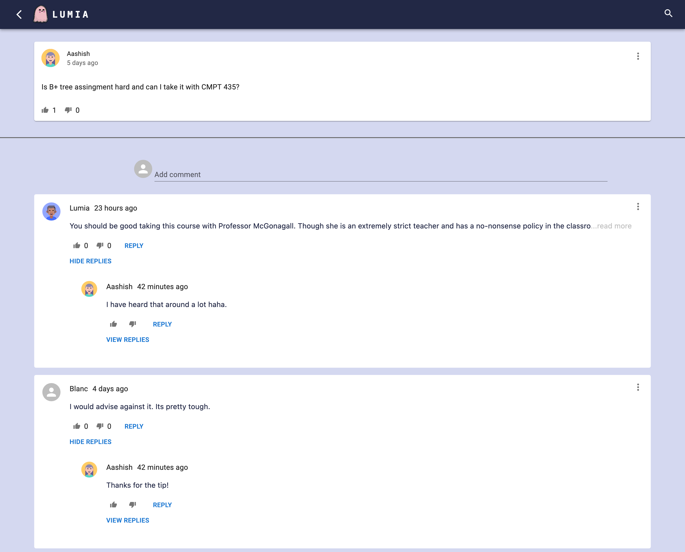
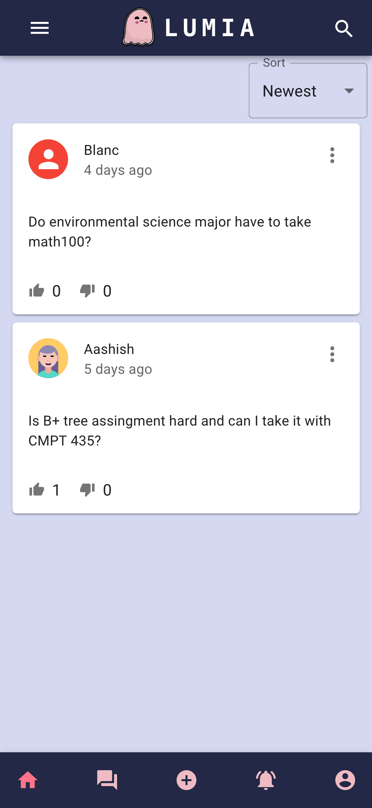
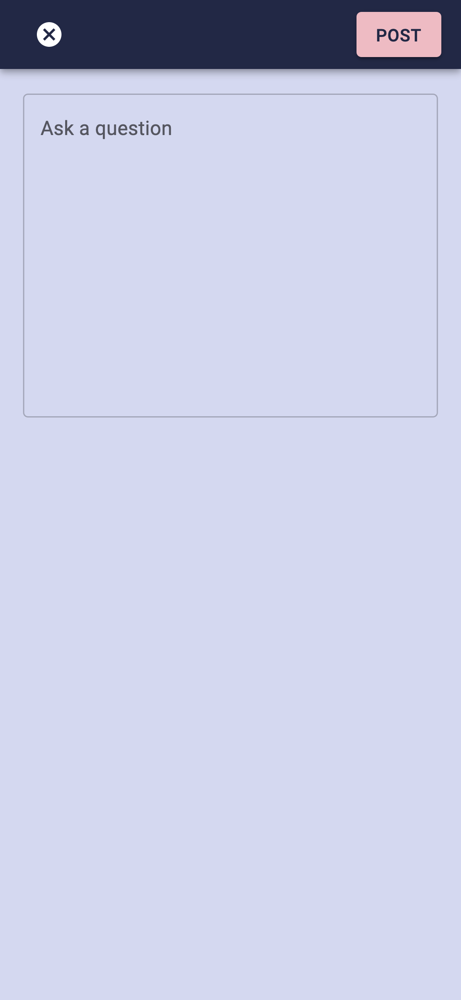
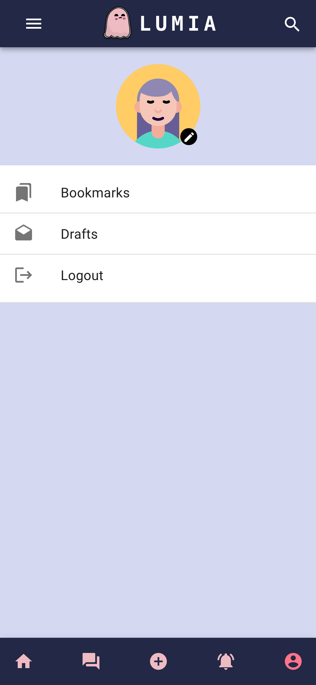

<div align="center"><h1>Lumia</h1></div>
<div align="center"><h3>Being a student made easy</h3></div>
<div align="center"></div>


<pre><div align="center">       </div></pre> 


# Table of Content:
- [Live Website](#live-website)
- [Display Shots](#display-shots)
- [Running the project](#running-the-project)
- [Lighthouse Score](#lighthouse-score)
- [Stack in use](#stack-in-use)
- [Future scope](#future-scope)
- [Demo video](#demo-video)

## Live Website: 
Since the application is loaded on free plan for render it might take a bit to load the website. Render spins up a container before serving it for the client.

```
https://lumia-uhhn.onrender.com
```


## Display Shots
<pre><div align="center"></br>           </br>
   
<div>

</div>
</div></pre>


## Running the project
- Clone the project
- Open the project is VS code (or your favorite editor)
- Create a firebase account
- Add Firebase Admin config in api/auth/adminconfig.json
- Add Firebase client config in config/initAuth.js
- Create a planetscale account and follow the setup steps for <a href="https://docs.planetscale.com/docs/tutorials/prisma-quickstart" target="_blank">prisma + planetscale</a>
- Fill up env variables for Firebase and Planetscale
- Run npm install
- Run npm run dev


## Lighthouse Score


## Stack in use
- Nextjs : Since Lumia involves user generated content , I wanted the SEO to be good and use server side rendering for the pages.
- Firebase : Lumia delegated authentication and user management to Firebase.
- Graphql : For live notification updates while using Lumia , Lumia relies on Graphql Subscriptions. It will further improve upon realtime updates for better UX through graphql.
- Planetscale : For complex relations and no pain schema change deployments, Lumia heavily relies on planetscale, a MySQL DB that just works.
- Prisma : To utilize its full type safety and automated workflows to ship schema changes and write queries with less work.


## Future scope
- Lumia can be utilized efficiently if every university or college have their own cluster and small communities. So Lumia will adapt Docker and have Kubernetes clusters for admins to deploy. 
- Adding verification process and moderation for users.
- Option to mark as "Best Answer"
- Different widgets : Creating different post types. For example Polls.
- Support images and emojis in questions and answers
- Adding translate options (like in youtube comments) and dark mode.
- Adding PWA support
- <a href="https://blog.meteor.com/optimistic-ui-with-meteor-67b5a78c3fcf">Optimistic UI</a>


## Demo video
```
https://youtu.be/4GOFJ-Uc764
```
